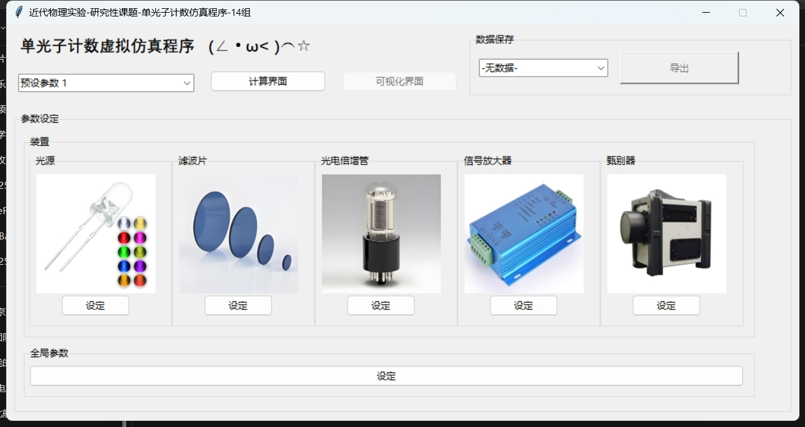
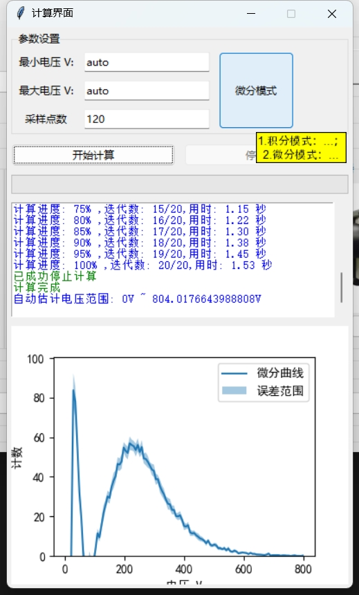
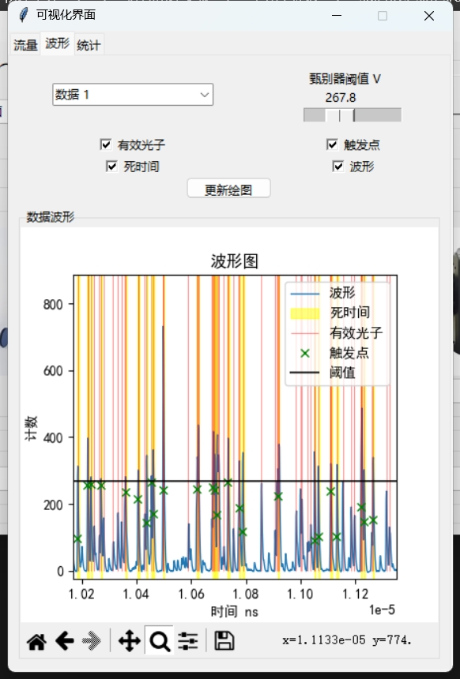

# 单光子计数模拟项目 (sglPhtCt_sim_src_v1_3)

## 项目简介

本项目旨在模拟单光子计数实验，帮助用户理解和分析单光子计数的物理过程。通过该模拟程序，用户可以研究单光子探测器的性能、噪声特性以及计数统计规律。

## 功能特性

- 模拟单光子探测器的响应过程。
- 支持多种噪声模型的配置。
- 提供统计分析工具，用于研究计数分布。
- 可视化模拟结果，便于数据分析。

## 文件结构

- `main.py`：主窗口文件。
- `intg_panel.py`：积分界面文件。
- `para_panel.py`：参数设定界面文件。
- `para_preset.py`：参数预设。
- `sim_core.py`：仿真核心程序文件。
- `output_panel.py`：文件导出界面文件。
- `discr_count_lib.dll`：光子计数处理程序，使用C语言编译提高运行效率。
- `visual_panel.py`：可视化界面文件。
- `readme.md`：项目说明文件。

## 环境依赖

运行本项目需要以下环境和依赖：

- Python 3.8 或更高版本
- 必要的Python库：
  - `numpy`
  - `matplotlib`
  - `scipy`

可以通过以下命令安装依赖：

```bash
pip install -r requirements.txt
```

## 使用方法

1. 进入项目目录：
   ```bash
   cd sglPhtCt_sim_src_v1_3
   ```
2. 运行主程序：
   ```bash
   python main.py
   ```
3. 根据提示配置模拟参数并查看结果。

## 示例

运行程序后，用户可以选择不同的参数，例如探测器效率、噪声水平等。以下是一个简单的示例：

```bash
python main.py
```

运行效果示例：
主界面

计算界面

可视化界面



## 贡献

欢迎对本项目提出改进建议或提交代码贡献。请确保提交前运行所有测试以验证代码的正确性。
